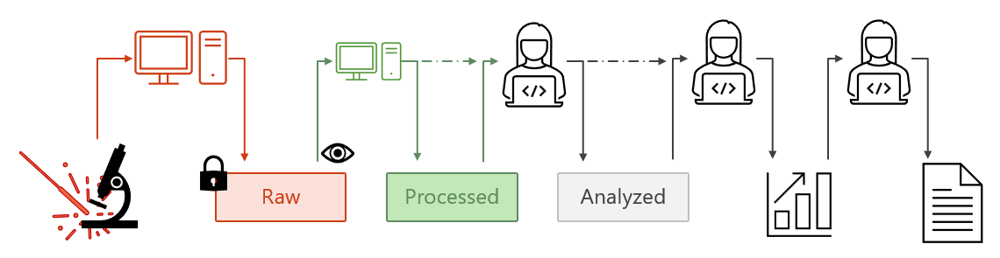

# PhD Parser

Helper functions to read and process data from different equipment. It's for the Urakawa research group at TU Delft and their laboratories.

The idea is to enable access to experimental data from raw files, and store that data in useful data formats with as much metadata as possible. This repo is not meant to analyze the data using models or for plotting. It simply covers the retrieval, cleaning and processing of data. For deeper analysis and plotting, consult other repos.

> [!WARNING]
> This repo is under active development and is changing rapidly.

> [!NOTE]
> As this repo is simply for reading in data and does not contain any scientific output, the use of AI is heavy to speed up the process and curation.

## Intended way of use

If you know how to use git, clone the repo and use it as a package.

Otherwise, simply download the code and copy it.

Each equipment/parser is independently usable.

## Included Equipment

The idea for each equipment is that there is a core `Data` class which utilises diverse parsers to read in and process the raw files from specific equipment and setups. This repo is partially highly specified for our group's equipment. However, parts of it contain parsers for commercial manufacturers and file formats and are hence universally applicable.

### Labview

...

### Raman

#### Renishaw

1. TXT export

2. WDF export
    - Alex Henderson, DOI:10.5281/zenodo.495477
    - py-wdf-reader (T. Tian, MIT), https://github.com/alchem0x2A/py-wdf-reader
    - SpectroChemPy wdf reader (CeCILL-B)
    - gwyddion renishaw.c

#### B&W Tek

...

### XRD

...

### XPS

...

### TGA

...

### Infrared

The `IRData` class is the core container for infrared spectroscopy data. It wraps an `xarray.DataArray` with wavenumbers stored in SI units (m⁻¹) internally and supports both single spectra (1-D) and time-resolved series (2-D, with `scan` and `tos` coordinates). Absolute acquisition timestamps are reconstructed on demand from a `tos_start` stored in metadata plus the elapsed `tos` coordinate — this survives all transformations.

**Constructors**
- `from_arrays` — build from raw numpy arrays (wavenumber in cm⁻¹, values, optional `tos` and `tos_start`)
- `from_xarray` — wrap an existing `xr.DataArray`
- `from_netcdf` — load a previously saved NetCDF file
- `from_omnic_spa` — read Thermo OMNIC `.spa` files (single or series)

**Accessors**
- Unit conversions: `wavenumber`, `wavenumber_per_cm`, `wavelength`, `wavelength_nm`, `frequency`, `energy`, `energy_eV`
- Time: `tos`, `tos_start`, `timestamps`
- Selection: `get_scan`, `get_scan_by_tos`, `get_scan_by_tos_average`, `get_evolution`

**Processing (all immutable — return a new `IRData`)**
- Selection: `sort`, `select_wavenumber_range`, `select_tos_range`
- Smoothing: `smooth_savgol`, `smooth_gaussian`, `smooth_moving`
- Baseline correction: `correct_offset`, `correct_pchip`, `correct_baseline`, `reapply_baseline`
- Averaging: `average_scans`, `average_scans_by_tos`
- Normalisation: `normalise_max`, `normalise_integral`, `normalise_reference`, `normalise_reference_scan`, `normalise_reference_by_tos`, `normalise_value_range`, `normalise_value`
- Arithmetic: `+`, `-` between compatible `IRData` objects

**Export**
- `to_csv` — wavenumber-indexed CSV (cm⁻¹ or m⁻¹)
- `to_netcdf` — round-trippable NetCDF preserving metadata

#### OMNIC (Thermo Scientific)

Parser for `.spa` files via `phd_parser.infrared.omnic`. Supports single-spectrum files and series with optional `delta_time_seconds` or explicit `tos_start`.

### MS

#### Quadstar for MS in building 67 - Box 5

...