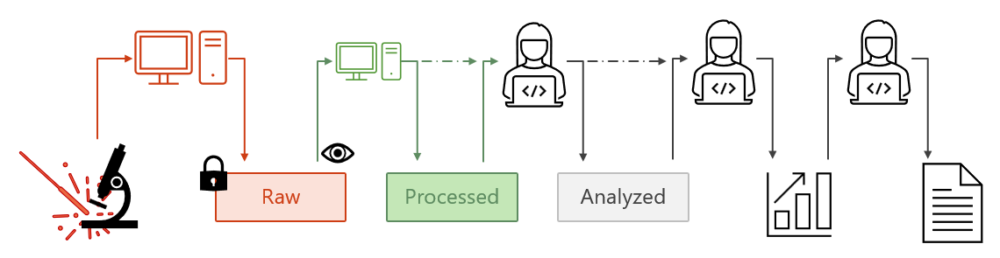

# PhD Parser

Helper functions to read and process data from different equipment. It's for the Urakawa research group at TU Delft and their laboratories.

The idea is to enable access to experimental data from raw files, and store that data in useful data formats with as much metadata as possible. This repo is not meant to analyze the data using models or for plotting. It simply covers the retrieval, cleaning and processing of data. For deeper analysis and plotting, consult other repos.



> [!WARNING]
> This repo is under active development and is changing rapidly.

> [!NOTE]
> As this repo is simply for reading in data and does not contain any scientific output, the use of AI is heavy to speed up the process and curation.

## Intended way of use

If you know how to use git, clone the repo and use it as a package.

Otherwise, simply download the code and copy it.

Each equipment/parser is independently usable.

```python
import phd_parser as pp
from pathlib import Path
import pandas as pd
```

---

## Core concepts

### `tos_start` — anchoring time-on-stream to the clock

Every data class stores time as *time-on-stream* (`tos`): elapsed seconds since the experiment began. This is a stable, unit-free axis that does not depend on clocks or timezones and survives all transformations and NetCDF round-trips.

To link `tos` back to wall-clock time you supply a `tos_start` once at construction time — a timezone-aware `pandas.Timestamp`. Absolute timestamps are then derived on demand from `tos_start + tos` and are never stored as a coordinate.

```python
tos_start = pd.Timestamp("2026-04-21 14:42:00", tz="Europe/Amsterdam")

lv  = pp.labview.LVData.from_b67_box5_txt(dir_lv, tos_start=tos_start)
ms  = pp.massspec.MSData.from_quadstar_asc(asc_file, tos_start=tos_start)
ir  = pp.infrared.IRData.from_omnic_spa(dir_spa, tos_start=tos_start)
```

Because every instrument shares the same `tos_start`, a single `tos` value means the same moment in all three datasets — making cross-instrument alignment trivial.

#### Changing the origin afterwards

`LVData`, `IRData` and `MSData` each expose the same four immutable methods, mirroring the `with_` / `set_` / `del_` trio used for backgrounds. The distinction that matters is **what stays fixed**:

| Method | What it changes | What stays fixed |
|---|---|---|
| `with_tos_start(tos_start)` | re-anchors: `tos` shifts by minus the distance the origin moved | the absolute timestamps — every sample keeps the wall-clock it was recorded at |
| `set_tos_start(tos_start)` | stamps a new origin, `tos` untouched | the `tos` values — the absolute timestamps all move with the origin |
| `del_tos_start()` | drops the origin | `tos`, which becomes a purely relative axis (`timestamps` → `None`) |
| `move_tos_start_by(delta)` | `with_tos_start(tos_start + delta)` | the absolute timestamps |

Use `with_tos_start` when the *reference point* of the experiment changes — e.g. re-zeroing time to when gas flow started rather than when logging did. Use `set_tos_start` when the elapsed times are right but the wall-clock they were anchored to was wrong.

```python
# Re-zero all three datasets to the moment reaction gas hit the reactor.
t_reaction = pd.Timestamp("2026-04-21 15:12:30", tz="Europe/Amsterdam")
lv, ms, ir = (d.with_tos_start(t_reaction) for d in (lv_raw, ms_raw, ir_raw))
# tos == 0 now means the same instant everywhere; timestamps are unchanged.

# Nudge the origin 90 s later (equivalently: shift every tos down by 90 s).
ir = ir.move_tos_start_by(90)          # seconds
ir = ir.move_tos_start_by("1h30min")   # or any pandas.Timedelta / string
```

Mind the sign: moving the origin **later** makes every `tos` value **smaller**. Pass a negative `delta` to move the origin earlier and grow the `tos` values.

`RamanData` carries a `tos` coordinate but no origin, and `XRDData` stores absolute timestamps as a coordinate instead — neither has this family.

---

### Immutable transformations — every method returns a new object

No processing method mutates the object it is called on. Instead, every method returns a *new* instance with the transformation applied, leaving the original intact. This means you can always go back to the raw data, compare intermediate stages, and chain operations in a single readable expression.

```python
# Each step produces a new object; the raw object is unchanged.
ir = (
    ir_raw
    .select_tos_range(0, 6 * 3600)
    .correct_baseline(anchor_range_cm=(2600, 2500),
                      control_points_cm=[3450, 3100, 2720, 1750, 1230])
)

ms = ms_raw.select_tos_range(0, 6 * 3600).correct_traces().mask_overloaded()
lv = lv_raw.select_tos_range(0, 6 * 3600)
```

The convention `*_raw` for the freshly-loaded object and a plain name for the processed version makes the lineage clear at a glance.

---

### Read once, cache as NetCDF

Parsing hundreds of `.spa` files from disk is slow. The recommended workflow is to parse and pre-process once, save to a compact NetCDF file, then load the NetCDF on every subsequent run. All metadata, backgrounds, coordinates, and processing history survive the round-trip.

```python
# First run — parse raw files, assign background, save.
ir_raw = (
    pp.infrared.IRData.from_omnic_spa(dir_spa, tos_start=tos_start)
    .with_background(pp.infrared.IRData.from_omnic_spa(bg_file, tos_start=tos_start))
)
ir_raw.to_netcdf(cache_path)

# Every subsequent run — fast load.
ir_raw = pp.infrared.IRData.from_netcdf(cache_path)
```

The same pattern applies to `MSData` and `LVData`.

---

## Included Equipment

The idea for each equipment is that there is a core `Data` class which utilises diverse parsers to read in and process the raw files from specific equipment and setups. This repo is partially highly specified for our group's equipment. However, parts of it contain parsers for commercial manufacturers and file formats and are hence universally applicable.

---

### Labview

The `LVData` class is the core container for LabView process data. It wraps an `xarray.Dataset` with a single `tos` dimension (elapsed seconds since `tos_start`). Each recorded channel (temperature, pressure, flow, valve state, …) is a separate data variable carrying its own per-channel metadata (`unit`, `group`, `species`, `location`) in `.attrs`. `tos_start` is stored as an ISO-8601 string in `metadata` so it survives all transformations; absolute timestamps are derived on demand from `tos_start + tos` and are never stored as a coordinate.

**Constructors**
- `from_dataframe` — build from a `pandas.DataFrame` with a timestamp column; timezone mismatches between the column and a supplied `tos_start` are reconciled automatically
- `from_netcdf` — load a previously saved NetCDF file
- `from_b67_box5_txt` — read LabView tab-separated exports from the high-pressure setup in building 67, box 5; accepts a single file or a directory of files

**Accessors**
- Core: `channels`, `n_samples`, `sampling_interval`
- Time: `tos`, `tos_start`, `timestamps`
- Channel: `get_channel` (values array by name), `get_channel_unit`, `filter_by_group` (channel names belonging to a group)

**Processing (all immutable — return a new `LVData`)**
- Selection: `select_channels`, `select_group`, `select_tos_range`
- Time origin: `with_tos_start`, `set_tos_start`, `del_tos_start`, `move_tos_start_by` (see [Changing the origin afterwards](#changing-the-origin-afterwards))
- Resampling: `resample` (bin into fixed-width time steps; `mean`, `median`, `first`, or `last` aggregation)
- Smoothing: `smooth_moving` (centered moving average)

**Export**
- `to_dataframe` — `tos`-indexed DataFrame, optional timestamp column
- `to_csv` — `tos`-indexed CSV (timestamp column included when `tos_start` is set)
- `to_netcdf` — round-trippable NetCDF preserving all channels and metadata

**Typical workflow**

```python
from pathlib import Path
import pandas as pd
import phd_parser as pp

dir_lv    = Path("path/to/labview")
tos_start = pd.Timestamp("2026-04-21 14:42:00", tz="Europe/Amsterdam")

# --- Load ---
lv_raw = pp.labview.LVData.from_b67_box5_txt(dir_lv, tos_start=tos_start)

# --- Crop to experiment window ---
lv = lv_raw.select_tos_range(0, 6 * 3600)

# --- Access channels ---
T_reactor = lv.get_channel("Reactor T PV")   # returns an xr.DataArray
P_analytic = lv.get_channel("Analytic P PV")

# Axis in hours: lv.tos / 3600
# Absolute timestamps: lv.timestamps

# --- Save / reload ---
lv_raw.to_netcdf(Path("path/to/cache.nc"))
lv_raw = pp.labview.LVData.from_netcdf(Path("path/to/cache.nc"))
```

#### Building 67, Box 5 (high-pressure setup)

Low-level parser in `phd_parser.labview.b67box5`:

- `read` — reads a single tab-separated file or a whole directory of `.txt`/`.csv` files in filename order and concatenates them; returns `(df, channel_meta, file_meta)`
- Timestamps parsed with format `%d-%m-%Y %H:%M:%S` and localised to `Europe/Amsterdam` by default
- Known channels with full metadata: reactor temperature (`Reactor T PV`, °C), analytics pressure (`Analytic P PV`, bar(a)), vent pressure (`Vent P PV`, bar(g)), mass-flow controllers for two lines (`F1` carrying He, H₂, CO₂ and CO; `F2` carrying He, H₂, CO₂ and Ar, all mL/min), and a feed valve state (`Feed`)
- Values use a comma decimal separator and are converted to float on read

**The export changes over time — both old and new files are readable.** The channel set has grown at least once (`F1 CO PV` was added in 2026-07), so files recorded months apart carry different columns:

- A directory holding files from either side of such a change concatenates on the *union* of the columns; a channel a given file did not record is NaN over that file's rows, and a warning names which file was missing which channel
- Columns the parser does not recognise are **skipped** with a warning naming them, rather than breaking the read. Add them to `CHANNEL_META` in `phd_parser.labview.b67box5` to read them in with proper metadata, or pass `keep_unknown_channels=True` to `from_b67_box5_txt` / `read` to keep them with empty metadata

---

### Raman

The `RamanData` class is the core container for Raman spectroscopy data. It wraps an `xarray.DataArray` with the Raman shift axis stored in SI units (m⁻¹) internally, using the Stokes convention (positive shift). Three array layouts are supported: `(shift,)` for a single spectrum, `(scan, shift)` for a time series, and `(y, x, shift)` for a spatial map. An optional `tos` coordinate on the `scan` dimension carries elapsed time in seconds. The excitation laser wavelength is stored as a separate `excitation_wavelength_nm` field and used to compute all derived spectral axes as cached properties.

**Constructors**
- `from_arrays` — build from raw numpy arrays (shift in cm⁻¹, values, optional `tos`)
- `from_netcdf` — load a previously saved NetCDF file
- `from_btc655n_export` — read a B&W Tek BTC655N export; converts absolute wavelength to Raman shift using the laser wavelength stored in the file header
- `from_renishaw_txt` — read a Renishaw WiRe ASCII export (two-column: Raman shift in cm⁻¹, intensity)
- `from_renishaw_wdf` — read a Renishaw `.wdf` binary file; supports single spectra, time series, and XY maps; extracts the excitation wavelength directly from the file header

**Accessors**
- Shift axis: `shift` (m⁻¹), `shift_per_cm` (cm⁻¹)
- Derived spectral axes (cached): `excitation_wavenumber`, `excitation_wavenumber_per_cm`, `wavenumber`, `wavenumber_per_cm`, `wavelength`, `wavelength_nm`, `frequency`
- Data: `values`, `n_spectral`, `ndim`, `shape`, `values_label`
- Time: `tos`
- Indexing: `get_scan` (single spectrum by integer scan index), `get_evolution` (intensity vs scan at one or more shifts; nearest or linear interpolation, optional tolerance), `get_map_spectrum` (single spectrum at a spatial position `(x, y)`)

**Processing (all immutable — return a new `RamanData`)**
- `sort` — sort the shift axis ascending or descending
- `select_shift_range` — crop to a spectral window (in cm⁻¹)

**Export**
- `to_csv` — shift-indexed CSV (cm⁻¹ or m⁻¹); columns labelled by `tos_Xs` or `scan_N`; map data (3-D) must use NetCDF
- `to_netcdf` — round-trippable NetCDF preserving all dims, coords, and metadata

#### Renishaw (WiRe)

Low-level parsers in `phd_parser.raman.renishaw`:

- `read_export_txt` — reads a two-column ASCII export (Raman shift in cm⁻¹, intensity); returns `{meta, data}` with instrument and path metadata
- `read_export_wdf` — full binary WDF block-format reader: locates all blocks (`WDF1`, `XLST`, `DATA`, `ORGN`, `WMAP`), extracts the wavenumber axis, spectral data, laser wavenumber, measurement and scan type, stage X/Y/Z positions, per-acquisition timestamps, and map geometry; reshapes data into `(n_spectra, n_points)` for series or `(height, width, n_points)` for maps; returns a `WDFResult` dataclass

The WDF reader is a stripped-down, dependency-free implementation drawing on SpectroChemPy, py-wdf-reader (T. Tian, MIT, DOI:10.5281/zenodo.495477), and gwyddion's renishaw.c.

#### B&W Tek (BTC655N)

Low-level parser in `phd_parser.raman.btc655n`:

- `read_export` — reads a semicolon-delimited `.txt` export; splits the file into a metadata header (semicolon-separated key–value pairs) and a tabular data section starting at the `Pixel` column row; returns `{meta, data}`
- Supported x-keys: `Pixel`, `Wavelength`, `Wavenumber`, `Raman Shift`
- Supported y-keys: `Dark`, `Reference`, `Raw data #1`, `Dark Subtracted #1`, `%TR #1`, `Absorbance #1`, `Irradiance (lumen) #1`
- The `laser_wavelength` metadata field is required by `RamanData.from_btc655n_export` for the wavelength-to-shift conversion

---

### XRD

The `XRDData` class is the core container for X-ray diffraction data. It wraps an `xarray.DataArray` with the 2θ angle stored in degrees throughout (no internal SI conversion). Two layouts are supported: `(angle,)` for a single diffractogram and `(scan, angle)` for a time series, with optional `tos` (seconds) and `timestamp` (datetime) coordinates on the `scan` dimension. Derived angular quantities (θ, radians) are cached properties; d-spacing and the scattering vector Q are computed on demand given a wavelength, defaulting to Cu Kα₁ (1.5406 Å).

**Constructors**
- `from_e1290` — read a two-column `.xy` file from the E1290 setup; optional `normalize` divides intensity by its maximum on load

**Accessors**
- Angle axis: `angle` (2θ, degrees)
- Cached conversions: `angle_rad` (2θ in radians), `theta_deg` (Bragg angle θ in degrees), `theta_rad` (θ in radians)
- Wavelength-dependent (method, not cached): `d_spacing(wavelength_angstrom)` — d-spacing in Å via Bragg's law; `q_vector(wavelength_angstrom)` — scattering vector magnitude Q in Å⁻¹
- Data: `values`, `ndim`, `shape`
- Time: `timestamps`

**Processing (all immutable — return a new `XRDData`)**
- `sort` — sort the angle axis ascending or descending
- `select_angle_range` — crop to a 2θ window `[min_deg, max_deg]`
- `smooth_savgol` — Savitzky–Golay filter (configurable `window_length` and `polyorder`)
- `smooth_gaussian` — Gaussian filter with `sigma_deg` specified in degrees (converted to index units automatically)
- `smooth_moving` — centered moving-average kernel

#### E1290 setup

Low-level parser in `phd_parser.xrd.xrd_e1290`:

- `read_xy_e1290` — reads a two-column whitespace-separated `.xy` file (one header row skipped); returns a `(2, N)` float64 array `[angle, intensity]`; optional `normalize` divides intensity by its maximum

---

### XPS

...

---

### TGA

The `TGAData` class is the core container for thermogravimetric analysis data. It holds parallel `temperature` and `mass` arrays together with an optional `mass_init` for computing normalised mass fractions and an optional `baseline` TGAData stored for provenance after blank subtraction.

**Constructor**
- `from_e2290` — read a Mettler Toledo TGA E2290 export (`.txt`); optional `baseline_path` applies blank subtraction immediately after loading; `in_kelvin=True` (default) converts the temperature axis from °C to K

**Accessors**
- `mass_fraction` — `mass / mass_init`; returns zeros if `mass_init` is not set
- `derivative` — d(mass)/d(temperature) via `numpy.gradient`
- `derivative_fraction` — d(mass_fraction)/d(temperature)

**Processing (all immutable — return a new `TGAData`)**
- Trimming: `cut_front`, `cut_back` — crop by integer index or temperature value
- Baseline correction: `correct` — subtract a blank `TGAData` via interpolation onto the sample's temperature axis; stores the reference as `baseline` on the returned object
- Smoothing: `smooth` — Savitzky–Golay filter (configurable `window_length` and `polyorder`)

#### Mettler Toledo TGA (E2290)

Low-level parser in `phd_parser.tga.e2290`:

- `read_export` — reads a Mettler Toledo TGA `.txt` export and returns a dict with keys: `data` (DataFrame with temperature `Ts` and mass `Value` columns), `units` (list of column units), `curve_name`, `saved_at` and `performed_at` timestamps, `sample_name`, `weight` (initial sample mass in mg), and `method`
- Splits the file into five tagged sections (`Curve Name`, `Curve Values`, `Results`, `Sample`, `Method`) using section-start keywords
- Data rows parsed with whitespace separation; sample weight extracted from the `Sample` section (`<name>, <X.X>mg` format)

---

### Infrared

The `IRData` class is the core container for infrared spectroscopy data. It wraps an `xarray.Dataset` (`ds`) with wavenumbers stored in SI units (m⁻¹) internally. The primary spectrum is `ds["data"]`; an optional `ds["background"]` (always single-beam, 1-D) is stored alongside it, and an optional `ds["baseline"]` (same shape as `data`) holds the cumulative curve removed by baseline correction. All metadata lives in `ds.attrs`. Two data layouts are supported: `(wavenumber,)` for a single spectrum and `(scan, wavenumber)` for a time series, with an optional `tos` coordinate (seconds) on the `scan` dimension. Absolute acquisition timestamps are reconstructed on demand from `tos_start + tos` and are never stored as a coordinate.

Every spectrum carries a `data_type` attribute that records the physical representation:

| `data_type` | Description |
|---|---|
| `single_beam` | Raw detector signal |
| `absorbance` | −log₁₀(T); default for OMNIC transmission data |
| `transmittance` | I_sample / I_background |
| `reflectance` | I_sample / I_background (reflection experiment) |
| `log_1_r` | −log₁₀(R); pseudo-absorbance for DRIFTS/ATR |
| `kubelka_munk` | (1−R)² / (2R) |

**Constructors**
- `from_arrays` — build from raw numpy arrays (wavenumber in cm⁻¹, values, optional `tos`, `tos_start`, `data_type`)
- `from_xarray` — wrap an existing `xr.DataArray` or `xr.Dataset`
- `from_netcdf` — load a previously saved NetCDF file
- `from_omnic_spa` — read Thermo OMNIC `.spa` files (single file or directory); `data_type` is mapped automatically from the OMNIC header; unknown types raise `ValueError`. `backend` selects the low-level reader: `"auto"` (default) uses SpectroChemPy when installed and falls back to the built-in binary parser, `"spectrochempy"` forces it, `"omnic"` forces the built-in one
- `from_scp` — wrap an existing SpectroChemPy `NDDataset`, however it was produced (read from a file, processed, or built programmatically)

> **One file is just a one-element series.** Reading a single `.spa` gives the same structure as reading a directory — 2-D `(scan, wavenumber)` with one scan and a `tos` coordinate — so `tos_start` applies either way and nothing downstream has to special-case it. A one-scan instance is accepted anywhere a single spectrum is expected, e.g. `series.with_background(background_from_one_file)`.
>
> Every argument after the path is **keyword-only** on `from_omnic_spa` / `from_scp`: `from_omnic_spa(dir, filename)` used to land `filename` in `wavenumber_2SI_factor` and multiply the axis by a string. Join the path yourself — `from_omnic_spa(dir / filename)`. A path that exists but holds no `.spa` file raises `FileNotFoundError` naming the directory, and an unknown `backend` value raises instead of silently falling back to `"auto"`.

**Accessors**
- Spectrum: `values`, `ndim`, `shape`, `data_type`
- Wavenumber axis: `wavenumber` (m⁻¹), `wavenumber_per_cm` (cm⁻¹)
- Cached unit conversions: `wavelength`, `wavelength_nm`, `wavelength_mum`, `frequency`, `energy`, `energy_eV`, `energy_kJ_per_mol`
- Time: `tos`, `tos_start`, `timestamps`
- Background: `has_background`, `background` (numpy array), `background_data_type`
- Baseline: `has_baseline`, `baseline` (numpy array, same shape as `values`), `data_unbaselined` (`values + baseline`, i.e. the spectrum before baseline correction)
- Scan retrieval: `get_scan`, `get_scan_by_tos`, `get_scan_by_tos_average`, `get_evolution`
- Baseline retrieval: `get_baseline_scan`, `get_baseline_by_tos`

**Background management (all immutable — return a new `IRData`)**

The background is always stored as `single_beam`. When a background is already set, switching it triggers automatic recalculation of the data values (e.g. `A_new = A_old + log₁₀(bg_new / bg_old)`).

- `with_background(background, data_type)` — set (no existing background) or switch (recalculates values); accepts `IRData` or numpy array
- `with_background_scan(scan_index)` — use an existing scan as background; converts it from the current `data_type` to `single_beam` automatically
- `with_background_by_tos(target_tos)` — same as above, addressed by time-on-stream
- `set_background(background, data_type)` — force-assign a background without recalculating values (drops any existing background first)
- `del_background()` — remove the background without changing data values

**Baseline management (all immutable — return a new `IRData`)**

`correct_offset`, `correct_pchip`, and `correct_baseline` don't just subtract a curve — they accumulate it into `ds["baseline"]`, so the pre-correction spectrum is never lost.

- `data_unbaselined` — the spectrum as it was before any baseline correction (`values + baseline`)
- `unbaseline()` — returns a new `IRData` with `data` set back to `data_unbaselined` and the baseline cleared, so the regular getters (`get_scan`, `get_scan_by_tos`, `get_evolution`, …) transparently return pre-correction values, e.g. `ir.unbaseline().get_scan_by_tos(3600)`
- `get_baseline_scan(scan_index)` / `get_baseline_by_tos(target_tos)` — fetch the stored baseline curve itself, mirroring `get_scan` / `get_scan_by_tos`
- `del_baseline()` — remove the stored baseline without changing data values

A stored baseline is dropped automatically (with a logger warning) whenever it would no longer be valid: switching `data_type` (`to_absorbance()`, etc.), switching to a different background, or combining two spectra with `+`/`-`. Re-run `correct_baseline()` afterward if you still need it.

**Type conversion (all immutable — return a new `IRData`)**

Conversions follow experiment type: transmission-side (`single_beam → transmittance → absorbance`) and reflection-side (`single_beam → reflectance → log_1_r → kubelka_munk`) are distinct. `absorbance → reflectance` is supported for the common case where OMNIC stores DRIFTS data labelled as absorbance.

- `to_transmittance()` — from `single_beam` (needs background) or `absorbance`
- `to_reflectance()` — from `single_beam` (needs background), `absorbance`, `log_1_r`, or `kubelka_munk`
- `to_absorbance()` — from `single_beam` (needs background) or `transmittance`
- `to_log_1_r()` — from `single_beam` (needs background), `reflectance`, `absorbance`, or `kubelka_munk`
- `to_kubelka_munk()` — from any reflectance-reachable type; routes through `to_reflectance()` internally
- `to_single_beam()` — the inverse of all of the above: re-applies the stored background to get back to raw detector units (needs a background)

**Merging two measurements (all immutable — return a new `IRData`)**

When a run has to be interrupted — the spectrometer is restarted mid-experiment and a *second* background is recorded — the experiment ends up split across two files. `merge` joins them back into one along the scan (time) axis.

Nomenclature used throughout the repo: **merge** joins along the scan/time axis, **extend** would join along the energy axis (wavenumber), and **vstack** would stack 2-D data along a new dimension.

- `merge(other, ...)` — combine two measurements into one
- `IRData.merge_all(items, ...)` — fold `merge` over any number of measurements

The merge itself happens on `single_beam` data, because that is the only representation in which two segments recorded against *different* backgrounds are comparable. You don't have to do that conversion yourself: absorbance (or transmittance, log(1/R), …) segments are converted with `to_single_beam()`, merged, and converted back against the one surviving background — which is exactly right, since it re-references the second segment to the background that survived. Two segments that already share an identical background skip the round trip entirely.

The decisions `merge` makes for you:

| | |
|---|---|
| **data_type** | Preserved. Non-single-beam data is rebased through single beam, so the second segment's *values* change: they are recomputed against the surviving background. The round trip drops any stored baseline, with a warning. Pass `convert_to_single_beam=False` to raise instead and handle it yourself. |
| **order** | Segments are ordered by the *absolute* time of their first scan, not by `tos` — two files each starting at `tos=0` are only comparable through their `tos_start`. The earlier one is the *first* segment. |
| **`tos` / `tos_start`** | The merged data keeps the first segment's `tos_start` and leaves its `tos` untouched; the later segment's `tos` is shifted by the difference between the two `tos_start` values, so `timestamps` stays continuous across the join. |
| **background** | Exactly one survives — by default the first segment's, i.e. the one recorded *before* the experiment, not the mid-experiment one. |
| **baseline** | Kept only if *both* segments carry one, otherwise dropped with a warning. |
| **scan ids** | Renumbered `0 … n-1`; a JSON record of the operation is appended to `ds.attrs["merge_log"]`. |

Overrides: `keep_background` (`"first"` / `"last"` / `"none"`, or an explicit array / 1-D `IRData`), `order` (`"auto"` / `"given"`), `sort` (sort merged scans by `tos`; independent of `order`), `tos_offset_seconds` (relate two time axes explicitly — the way to merge segments with no absolute timestamps), `on_overlap` (`"warn"` / `"raise"` / `"ignore"` / `"trim"` the duplicated scans of the second segment), `wavenumber` (`"strict"` requires identical axes, `"interp"` interpolates the second segment onto the first's grid restricted to the common range), and `convert_to_single_beam` (`False` refuses the automatic rebasing).

1-D operands are promoted to a single scan, so two single spectra merge into a 2-D instance and a spectrum can be merged into a series.

```python
IRData = pp.infrared.IRData

# Before the restart: background recorded at the start of the experiment.
part_1 = (
    IRData.from_omnic_spa(dir_before_restart, tos_start=tos_start_1)
    .with_background(IRData.from_omnic_spa(bg_file_1, tos_start=tos_start_1))
)
# After the restart: a second background, recorded mid-experiment.
part_2 = (
    IRData.from_omnic_spa(dir_after_restart, tos_start=tos_start_2)
    .with_background(IRData.from_omnic_spa(bg_file_2, tos_start=tos_start_2))
)

# One continuous run on one time origin; bg_file_1 survives, bg_file_2 is dropped.
# Works whatever the data_type is: absorbance in, absorbance out, with part_2
# re-referenced to bg_file_1 on the way through.
ir_raw = part_1.merge(part_2)

# Any number of files, in any order — the chronology decides:
ir_raw = IRData.merge_all([part_2, part_1, part_3])
```

**Processing (all immutable — return a new `IRData`; background and baseline are propagated automatically)**
- Selection: `sort`, `select_by_idx`, `select_by_tos`, `select_wavenumber_range`, `select_wavenumber_index_range`, `select_tos_range`, `select_scan_id_range`
- Time origin: `with_tos_start`, `set_tos_start`, `del_tos_start`, `move_tos_start_by` (see [Changing the origin afterwards](#changing-the-origin-afterwards))
- Merging: `merge`, `merge_all` (scan axis; see above)
- Smoothing: `smooth_savgol`, `smooth_gaussian`, `smooth_moving`
- Baseline correction: `correct_offset`, `correct_pchip`, `correct_baseline`, `reapply_baseline`, `unbaseline`, `del_baseline`
- Averaging: `average_scans`, `average_scans_by_tos`
- Normalisation: `normalise_max`, `normalise_integral`, `normalise_reference`, `normalise_reference_scan`, `normalise_reference_by_tos`, `normalise_value_range`, `normalise_value`
- Arithmetic: `+`, `-` between compatible `IRData` objects

**Signal quality**
- `snr_windows` — signal-to-noise ratio from separate signal and noise spectral windows; configurable signal metric (`max`, `peak_to_peak`, `integral`, `rms`) and noise metric (`std`, `rms`, `peak_to_peak`)
- `snr_noise_window` — noise estimated from a single flat region (polynomial detrend before estimation)
- `snr_der` — DER-SNR estimator from the second-difference of the spectrum (no reference region needed)
- `snr_repeat` — SNR from scan-to-scan repeatability (requires 2-D data)
- `snr_psd` — power-spectral-density estimator using the high-frequency tail of the FFT

**Gram-Schmidt chromatogram**
- `get_gram_schmidt(reference)` — orthogonal component of each scan relative to a reference subspace; useful for reconstructing a chromatographic profile from a hyphenated IR series
- `get_gram_schmidt_scan(reference_scans)` — convenience wrapper using scan indices as the reference
- `get_gram_schmidt_by_tos(reference_tos)` — convenience wrapper using time-on-stream as the reference

**Export**
- `to_netcdf` — round-trippable NetCDF preserving spectrum, background, coordinates, and all metadata

**Typical workflow**

```python
from pathlib import Path
import pandas as pd
import phd_parser as pp

dir_omnic   = Path("path/to/omnic")
dir_reac    = dir_omnic / "02_Reaction"
bg_file     = dir_omnic / "Background_2026-04-21.spa"
cache_path  = dir_omnic / "reaction.nc"

tos_start = pd.Timestamp("2026-04-21 14:42:00", tz="Europe/Amsterdam")

# --- First run: parse raw .spa files, assign background, save ---
ir_raw_bg = pp.infrared.IRData.from_omnic_spa(bg_file, tos_start=tos_start)
ir_raw = (
    pp.infrared.IRData.from_omnic_spa(dir_reac, tos_start=tos_start)
    .with_background(ir_raw_bg)           # store single-beam background;
)                                         # data values remain in original data_type
ir_raw.to_netcdf(cache_path)

# --- Subsequent runs: fast load ---
ir_raw = pp.infrared.IRData.from_netcdf(cache_path)

# --- Processing chain ---
anchor_range_cm    = (2600, 2500)
control_points_cm  = [3450, 3100, 2720, 2600, 2500, 2150, 1750, 1230, 800]

ir = (
    ir_raw
    .select_tos_range(0, 6 * 3600)                                   # crop to experiment window
    .correct_baseline(anchor_range_cm, control_points_cm)            # PCHIP baseline correction
    .select_wavenumber_range(1000, 3900)                             # discard noisy edges
)

# --- Inspect the baseline correction itself ---
tos = 1 * 3600
spectrum_uncorrected = ir.unbaseline().get_scan_by_tos(tos)   # spectrum before correction
baseline_curve = ir.get_baseline_by_tos(tos)                  # the curve that was subtracted
# spectrum_uncorrected - baseline_curve == ir.get_scan_by_tos(tos)

# Inspect a single averaged scan at 100 min TOS
spectrum = ir.get_scan_by_tos_average(100 * 60, direction="center", number_of_scans=10)

# Track peak intensity over time
evolution = ir.get_evolution(1600)   # wavenumber in cm⁻¹, returns tos-indexed array

# Average spectra at specific temperature setpoints
ir_temps = ir.average_scans_by_tos(
    tos_targets=[66*60, 126*60, 186*60, 246*60, 306*60],
    time_window=10 * 60,
    direction="backwards",
)
ir_region = ir_temps.select_wavenumber_range(1000, 1750).normalise_value(0.06)

# Signal-to-noise over time
snr = ir.snr_windows(signal_range_cm=(1500, 1750), noise_range_cm=(1800, 1900))
```

#### OMNIC (Thermo Scientific)

Low-level parser for `.spa` files in `phd_parser.infrared.omnic`:

- `read_spa` — reads a single `.spa` file, a directory of `.spa` files, or an iterable of paths; returns a dict with stacked `x`, `v` (always 2-D, one row per file), and `tos` arrays plus metadata (`vlabel`, `vunit`, `xlabel`, `xunit`, datetime list); raises `FileNotFoundError` when the path resolves to no `.spa` file
- Supports local paths and HTTP(S) URLs
- Time-of-scan (`tos`) derived from: explicit `tos_start`, a fixed `delta_time_seconds` increment, or the embedded file timestamps (default)
- Optional `sort_key` for ordering series (default extracts the "Spectrum Index N" pattern from filenames)
- Extracts core header fields (x/y units, number of points, spectral range) and acquisition datetime
- The `vlabel` from the OMNIC header is mapped to `IRDataType` via `_OMNIC_VLABEL_TO_DATA_TYPE`; unknown labels raise `ValueError` with instructions to extend the mapping

Due to the high overhead of SpectroChemPy [^1], this `read_spa` is a stripped-down version of their parser. For further processing beyond raw file reading, I recommend checking them out.

A SpectroChemPy-backed alternative lives in `phd_parser.infrared.spectrochempy` and is used by default when the library is installed (`backend="auto"`):

- `read_spa` — drop-in replacement for the built-in one: same arguments, same returned dict, so callers never need to know which backend ran
- `read_nddataset` — convert any `NDDataset` (read from a file, processed, or built programmatically) into the same dict; this is what `IRData.from_scp` uses
- `tos` comes from SpectroChemPy's acquisition timestamps when available, otherwise from the hours encoded in the filenames

---

### MS

The `MSData` class is the core container for mass spectrometry data. It wraps an `xarray.Dataset` that holds one `DataArray` per source datablock, named `block_{id}`. The primary block (`block_0`) carries the m/z channels with dims `(cycle, mz)`; auxiliary blocks (pressure, temperature, analog inputs, …) have their own per-block channel dims `(cycle, ch_N)` so that mixed units are never coerced onto a shared "mz" axis. The `cycle` dim (integer scan index) is shared across all blocks, and an optional `tos` coord (time on stream, seconds) rides along it. All metadata lives on the `Dataset` itself: file-level info and the correction audit trail go in `ds.attrs` (including `tos_start` as an ISO-8601 string), while per-block info (unit, type, original channel labels) lives in each DataArray's `.attrs`. When `tos_start` is set, absolute timestamps are reconstructed on demand as `tos_start + tos` — this survives all transformations and round-trips through NetCDF without a side-car dict.

**Constructors**
- `from_arrays` — build from raw numpy arrays (integer `cycle`, per-block `channels` and `values` dicts, optional `tos`, `tos_start`, `block_attrs`, `ds_attrs`)
- `from_quadstar_asc` — read Pfeiffer Quadstar `.asc` exports (any number of datablocks, auto-routes m/z columns into block 0 and everything else into auxiliary blocks)
- `from_netcdf` — load a previously saved NetCDF file

**Accessors**
- Blocks: `block_ids`, `n_blocks`, `channels`, `mz`, `values`, `unit`, `block_type`, `channel_labels`
- Time: `cycle`, `n_cycle`, `tos`, `tos_start`, `timestamps`
- Extraction (m/z block): `get_trace` (single m/z vs cycle; optional centered `rolling_window` mean and `normalize` to [0, 1] or fixed bounds — applied on the returned array without touching the stored data), `get_traces` (multiple m/z vs cycle; delegates to `get_trace` so all parameters pass through), `get_spectrum` (full m/z at a cycle)
- Extraction (any block): `get_channel` (single-channel trace from an auxiliary block)
- Derived: `tic` (total ion current vs cycle, NaN-safe, cached)

**Processing (all immutable — return a new `MSData`)**
- Selection: `select_tos_range`
- Time origin: `with_tos_start`, `set_tos_start`, `del_tos_start`, `move_tos_start_by` (see [Changing the origin afterwards](#changing-the-origin-afterwards))
- Data cleaning: `mask_overloaded` (replace values above a threshold — e.g. detector saturation spikes around 1e38 — with NaN, applied to one block or all)
- Smoothing: `smooth_trace_rolling` (centered rolling mean along the cycle dimension, configurable window and `min_periods`, applied to one block or all)
- Baseline / offset correction: `correct_traces` (shift negative m/z traces up to zero, targeted or across all channels of the m/z block), `baseline_subtract` (per-channel mean over a tos window, applied to one block or all)

All processing methods append an entry to `ds.attrs["trace_corrections"]` so the full processing history is preserved on the object and survives NetCDF round-trips.

**Export**
- `to_csv` — cycle-indexed CSV for a single block (one column per channel, optional `tos_s` and `timestamp` columns)
- `to_netcdf` — round-trippable NetCDF preserving all blocks, coords, and metadata

**Typical workflow**

```python
from pathlib import Path
import pandas as pd
import phd_parser as pp

asc_file  = next(Path("path/to/quadstar").glob("*.asc"))
tos_start = pd.Timestamp("2026-04-21 14:42:00", tz="Europe/Amsterdam")

# --- Load ---
ms_raw = pp.massspec.MSData.from_quadstar_asc(asc_file, tos_start=tos_start)

# --- Processing chain ---
ms = (
    ms_raw
    .select_tos_range(0, 6 * 3600)   # crop to experiment window
    .correct_traces()                 # shift any negative m/z traces up to zero
    .mask_overloaded()                # replace detector-saturation spikes (≈1e38) with NaN
)

# Extract individual m/z traces
trace_28 = ms.get_trace(28)                          # CO / N₂ vs cycle
trace_44 = ms.get_trace(44, normalize=(0, 1))        # CO₂ normalised to [0, 1]

# Save / reload
ms_raw.to_netcdf(Path("path/to/cache.nc"))
ms_raw = pp.massspec.MSData.from_netcdf(Path("path/to/cache.nc"))
```

#### Quadstar for MS in building 67 - Box 5

Low-level parser for `.asc` files in `phd_parser.massspec.quadstar`:

- `read_export` — reads a Quadstar ASCII export and returns `(meta, df)`: a metadata dict and a tidy `pandas.DataFrame` with one row per cycle
- Parses the four blank-line-delimited sections of the file: file header (name, date, time, converted cycles), cycle/datablock counts, per-datablock channel definitions (mass, min/max, thresholds), and the tabular data
- Builds an absolute `Timestamp` column from `Date` + `Time` and localises to a configurable timezone (default `Europe/Amsterdam`)
- Supports arbitrary numbers of datablocks with mixed units (e.g. `A`, `mbar`) and renames m/z channel columns from raw `'b/c'` identifiers to `m{mass}` form
- Builds a `column_map` (original → new name, unit, source datablock) stored on the metadata dict so downstream code (e.g. `MSData.from_quadstar_asc`) can route columns to the correct block — m/z columns go to `block_0`, everything else to `block_N` auxiliary blocks
- Optionally drops per-channel `Threshold` columns (`drop_threshold_cols=True` by default at the `MSData` constructor level)

---

### Physisorption (N₂ physisorption / BET)

The `PhysisorptionData` class is the core, instrument-agnostic container for a single gas-physisorption isotherm *branch* — relative pressure (P/P₀) versus quantity adsorbed (cm³/g STP) — wrapped exactly like a single Raman spectrum or XRD pattern elsewhere in this repo. There is no "branch" concept in the type itself: a reading that produces both adsorption and desorption returns two separate instances. The BET surface-area fit is modelled directly alongside the curve it was derived from (conventionally the adsorption branch), since virtually every physisorption analysis method agrees on it. Other instrument-specific analyses — t-Plot, BJH pore-size distribution, the sample log — are not modelled as typed accessors yet; they are preserved verbatim under `.report` for later use.

**Constructors**
- `from_arrays` — build from raw numpy arrays (`relative_pressure`, `quantity_adsorbed`, optional `bet` dict, optional `attrs`)
- `from_netcdf` — load a previously saved NetCDF file
- `from_tristar_xls` — read a Micromeritics TriStar II 3020 multi-report `.XLS` export; returns a `dict` with `"adsorption"`/`"desorption"` keys (whichever branches were present), only the isotherm and BET results are modelled directly, the rest of the parsed report is stashed under `.report` on each branch

**Accessors**
- `relative_pressure`, `values`, `n_points` — the isotherm curve and its length
- `bet`, `surface_area_bet` — BET fit results (surface area, slope, y-intercept, C constant, monolayer capacity, correlation coefficient, molecular cross-sectional area, each with `*_error`/`*_unit` siblings where applicable) and the headline surface area in m²/g; `None` on a branch with no BET fit
- `report` — raw, instrument-specific report data preserved for provenance (e.g. t-Plot/BJH/sample log for a TriStar export); stored JSON-encoded internally so it survives NetCDF round-trips

**Lookups**
- `get_quantity_adsorbed(target_relative_pressure, method, tolerance)` — quantity adsorbed at one or more relative-pressure values; nearest/linear selection with an optional tolerance check, scalar in → scalar out

**Export**
- `to_netcdf` — round-trippable NetCDF preserving the isotherm, BET results, and the full raw report

**Typical workflow**

```python
from pathlib import Path
import phd_parser as pp

xls_file = Path("path/to/2026-N-198.XLS")

branches = pp.physisorption.PhysisorptionData.from_tristar_xls(xls_file)
adsorption = branches["adsorption"]

print(adsorption.surface_area_bet)                                  # BET surface area, m²/g
q_half = adsorption.get_quantity_adsorbed(0.5)                       # quantity adsorbed at P/P₀ = 0.5

# Everything else MicroActive reported is still there, just not typed yet:
t_plot = adsorption.report["analyses"]["t_plot"]
sample_log = adsorption.report["sample_log"]
```

#### TriStar II 3020 (Micromeritics)

Low-level parser in `phd_parser.physisorption.tristar`:

- `read_export` — parses a MicroActive "print selected reports to Excel" `.XLS` export, where every selected report is laid out as its own block of columns separated by a literal `"|"` divider column, all sharing the same row grid
- A generic state machine handles each block's `key: value` metadata rows, free-text notes, and at most one data table (header row + rows until the next blank row) — including the quirk where a sample-name caption row sits directly above the real column header
- Returns `{"data": {"adsorption": {...}, "desorption": {...}}, "bet": cleaned BET results, "meta": {"header", "summary", "analyses", "sample_log"}}`, where each branch in `"data"` is a `{"relative_pressure", "quantity_adsorbed"}` dict ready to pass into `PhysisorptionData.from_arrays(**branch)`, and `"analyses"` groups each property/analysis (`isotherm`, `bet`, `t_plot`, `bjh_adsorption`, `bjh_desorption`) into its own `{"report", "plots"}` dict

## References

[^1]: Travert, A., & Fernandez, C. (2025). *SpectroChemPy* (Version 0.8.4) [Computer software]. Laboratoire Catalyse and Spectrochemistry (LCS), Normandie Université/CNRS. https://github.com/spectrochempy/spectrochempy (CeCILL-B licence)